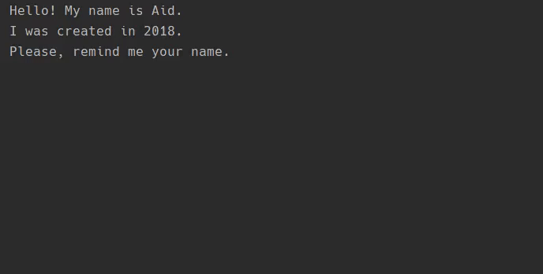

<h1 align="center"><strong><em>Simple Chatty Bot</strong></em></h1>

# About the project

This is my first project that I made in Python.

I made this project by following the <a href=https://hyperskill.org/tracks>JetBrains Academy</a> course.
 
  

<h1 align="center"><strong>Demonstration</strong></h1>

